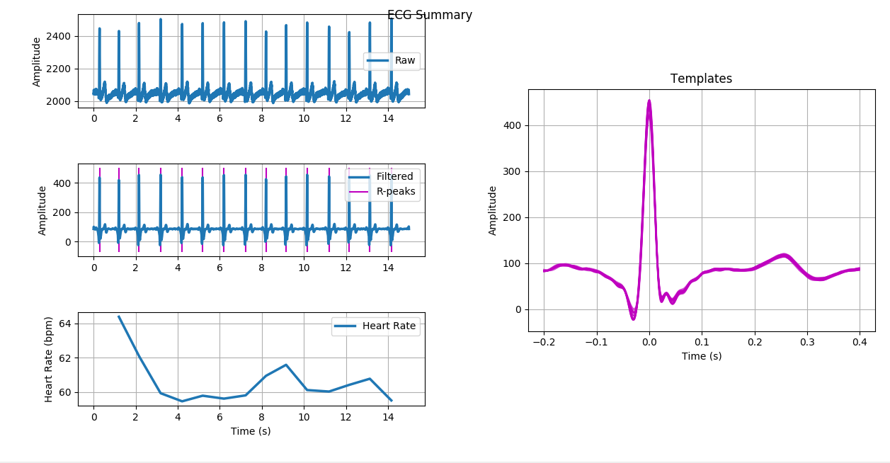

# Introduction to simple ECG data interpretation

## Objectives
1. Understanding Datasets

2. Understanding wfdb , biosppy module

3. Using image based methods for ECG

4. Find best ways to detect ECG changes - CNN, LSTM , or what?
 

## List of Databases avialable, with their key features.

1. MIT-bih-arrhythmia-database-1.0.0   - Published: Feb. 24, 2005

https://physionet.org/content/mitdb/1.0.0/

https://www.physionet.org/physiobank/database/html/mitdbdir/records.htm

symbols for the annotations - https://archive.physionet.org/physiobank/annotations.shtml

2. https://www.kaggle.com/sdfhbdskjgkndfkjw/mitbih2dimgdataset?  - MIT-BIH image converted versions

3. https://www.kaggle.com/analiviafr/ecg-images?   - MIT-BIH image converted versions

## INtersting papers to begin with 

1. https://stanfordmlgroup.github.io/projects/ecg/

## Important modules to learn
1. wfdb

2. biosppy

## Blogs to get started

https://towardsdatascience.com/detecting-heart-arrhythmias-with-deep-learning-in-keras-with-dense-cnn-and-lstm-add337d9e41f

https://medium.com/datadriveninvestor/ecg-arrhythmia-classification-using-a-2-d-convolutional-neural-network-33aa586bad67

https://medium.com/@smartsplash/installing-wfdb-package-in-terminal-9a39b9b7b65a

## Jupyter notebooks 
2.1 ECG_2D-CNN_FASTAI_basic_ipynb.ipynb

2.2 Keras_DenseNN,_1D_CNN,_LSTM.ipynb

uses simple NN, 1D-CNNs , LSTM        from - https://github.com/andrewwlong/deep_arrhythmias

2.3 wfdb_module_basic.ipynb

2.4 wfdb_module_data_processing.ipynb

